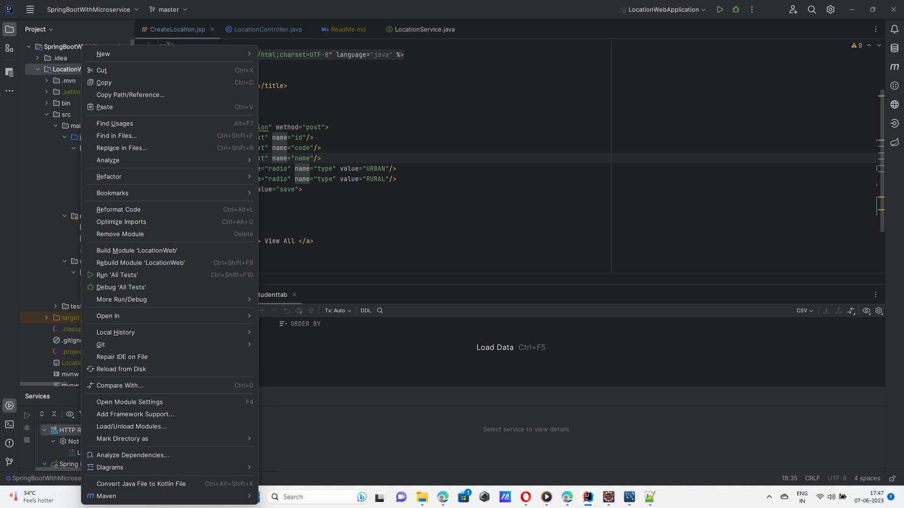
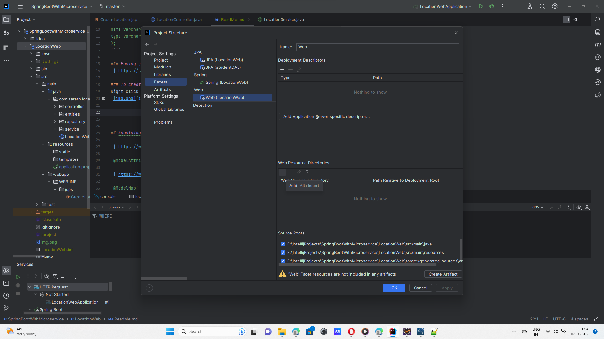
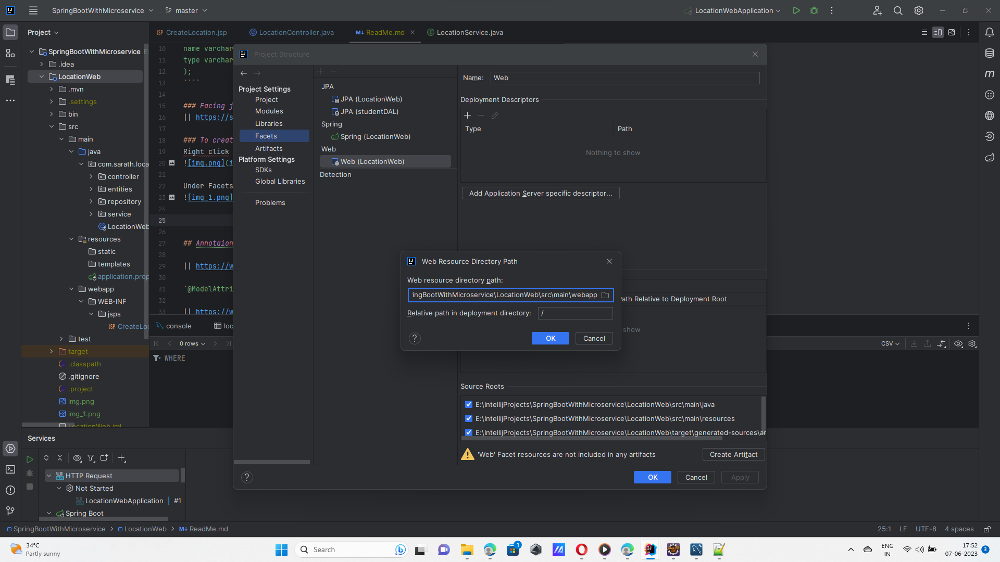

## SQL

````
use projectdb;

create table location
(
id int primary key,
code varchar(20),
name varchar(20),
type varchar(10)
);
````

## POSTMAN CRUD DOCUMENTATION

https://documenter.getpostman.com/view/24361294/2s93sgVABU

## Tomcat port stop
`Web server failed to start. Port 8080 was already in use.`

Open cmd as admin

netstat -a -o -n

taskkill /F /PID <PID of 8080>

# APPLICATION FAILED TO START


 APPLICATION FAILED TO START
***************************

Description:

Failed to configure a DataSource: 'url' attribute is not specified and no embedded datasource could be configured.

Reason: Failed to determine a suitable driver class


Action:

Consider the following:
    If you want an embedded database (H2, HSQL or Derby), please put it on the classpath.
    If you have database settings to be loaded from a particular profile you may need to activate it (no profiles are currently active).

```
<dependency>
    <groupId>org.springframework.boot</groupId>
    <artifactId>spring-boot-starter-data-jpa</artifactId>
    <scope>provided</scope>
</dependency>
``` 

## Facing jsp page creation in intellij
|| https://stackoverflow.com/a/75861228


### To create jsp file
Right click on the project and select open module settings


Under Facets, select web and web directories resource.


Change the directory to webapp


## Annotaion and its use

|| https://www.baeldung.com/spring-mvc-and-the-modelattribute-annotation

`@ModelAttribute` -> To handle the request from user

|| https://www.baeldung.com/spring-mvc-model-model-map-model-view

`@ModelMap` ->  To handle the response from server

