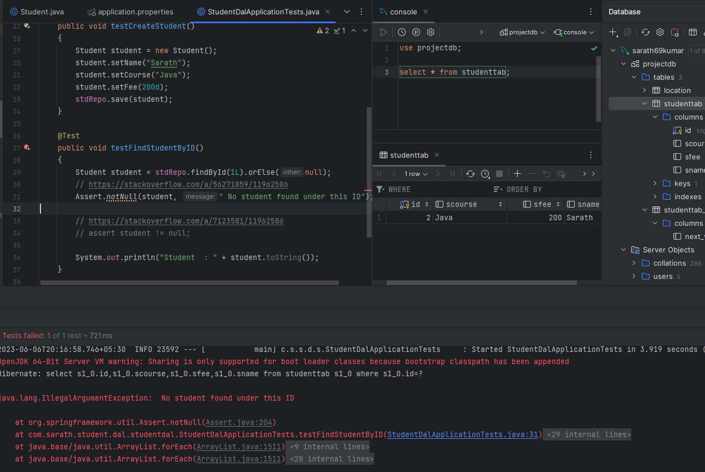

## Spring Boot
Documents:-

https://docs.spring.io/spring-boot/docs/


## SQL 

````
    create database projectdb;

    use projectdb;

    create table StudentTab
    (
    id int primary key auto_increment,
    sname varchar(20),
    scourse varchar(20),
    sfee int
    );

    select * from studentTab;

    drop table studenttab;
    
````

## Assert for null or not null
* without user argument

* With user argument



In JUnit 4, IDEA (UE 2020) suggests using assertThat(..., notNullValue()); instead of Assert.assertNotNull(...).

For instance:

1. [IDEA warning](https://i.stack.imgur.com/0QzkU.png)
2. [IDEA suggestions](https://i.stack.imgur.com/jeOYe.png)
3. [IDEA fix](https://i.stack.imgur.com/8XMXf.png)


